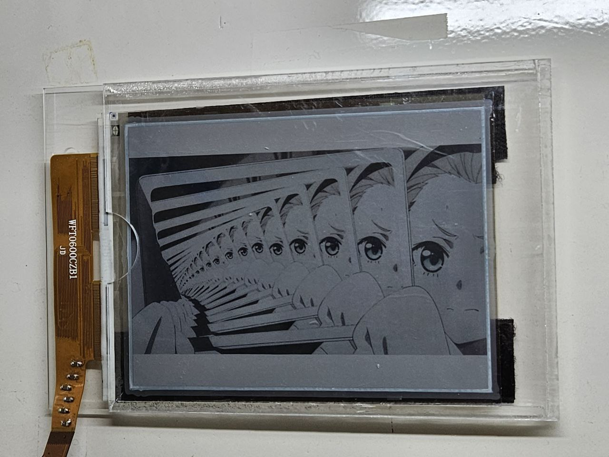
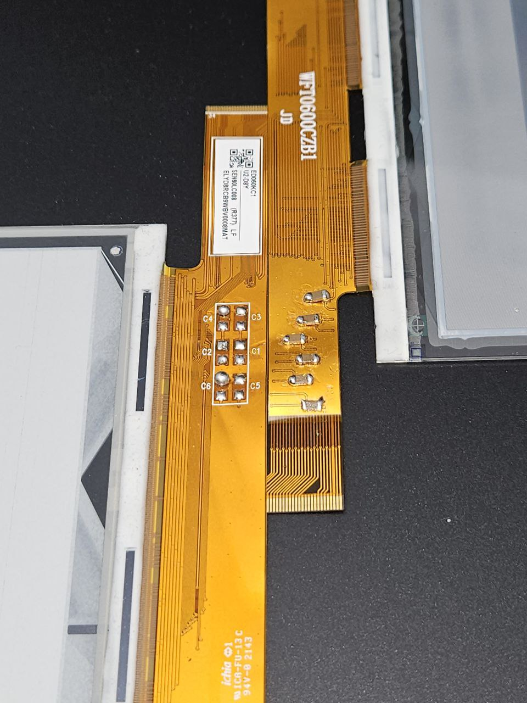

# Color e-paper Processor
Code to pre-process images for particular e-paper panels. The resulting image should then be possible to be uploaded onto the color e-paper panel 

# AAAAA Mite Kure

Results:


Source image from [MITE KURE mite kure ᵐⁱᵗᵉ ᵏᵘʳᵉ](https://youtu.be/GlWJCucT96s):
[Click for image](img/source.jpg)

# A necessary hardware change

Before making changes to the hardware, certain images if they have too much similar pixels horizontally would fail to display for no reason. 
[Click to show defect](img/grayscale-fail.jpg)

Capacitors were removed from a damaged black-and-white e-paper panel and added to this color e-paper panel, and the issue is fixed. 

Procedure:
1. Use a razor knife to scrape off the solder mask for the pads. Do not scrape too much. 
2. Desolder the capacitors from the old panel to the new panel
3. **Check for shorts across the capacitors.** A capacitor connects from signal to ground. The pad for signal lines is surrounded by ground. Shorts are caused because of excessive scraping, leading to a short to ground.

Results:



## Panel identification
The panel may go under various names. Key features are:
- "I80" connector
- Alternating RGB pixels in the following format:
```
RBGRBGRBG
GRBGRBGRB
BGRBGRBGR
```

## Panel sources
Here are some potential sources:
https://www.good-display.com/product/89/

-> https://www.good-display.com/product/365.html I own it. Tested working so far

https://shopkits.eink.com/product-category/color-epaper-modules/

## Usage
Currently this is in early alpha for proof-of-concept and exists as a script which requires user editing. ```tarwidth``` and ```tarheight``` should be edited for other panels, as well as the dithering logic. It depends on ImageMagick "convert.exe" for use in Windows platforms. 

## Todo
- Code refactoring and variable naming cleanup
- Make into package
- Cross-platform calling of ImageMagick
- Adapting for other panels
  - If you are in possession of other panels, please try and contact me
